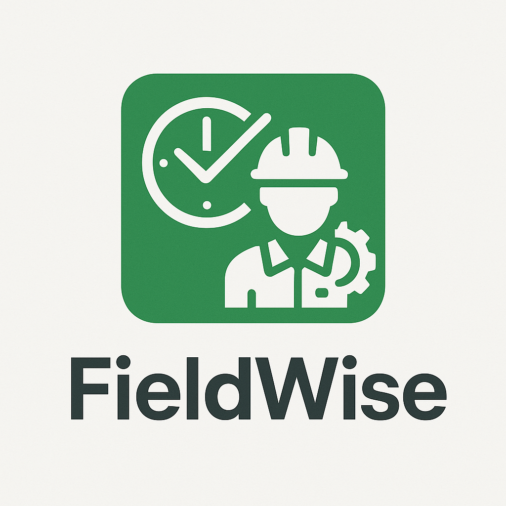

<p align="center"></p>


**FieldWise** is a cross-platform workforce management application designed for freelance and field IT technicians.  
It enables **clock-in/out tracking**, **work scheduling**, **digital signatures**, **PDF/Media uploads**, and **video messaging**, all secured by a **Spring Boot + PostgreSQL backend** with modern access control and encryption.


## 🚀 Overview

FieldWise empowers field engineers and IT support staff to record their daily work activities accurately and securely — whether online or offline.  
Managers and end clients can authorize completed tasks, approve time logs, and sign work orders digitally.

### 🔹 Core Features

| Category | Features |
|-----------|-----------|
| ⏰ **Time Management** | Clock-In / Clock-Out with GPS location, work scheduling, and timesheet tracking. |
| 🧾 **Digital Authorization** | End-user electronic signatures and work order validation. |
| 📸 **Media & Document Handling** | Upload photos, videos, scanned documents (PDF) with OCR extraction. |
| 🎥 **Video Messaging** | Record, send, and view short video messages for job updates. |
| 🌍 **GPS Presence Control** | Capture and validate user’s onsite GPS at check-in/out. |
| 🔐 **Security & Audit** | Role-based access, data encryption, signed audit logs, and immutable backup. |
| 💬 **Cross-Platform Apps** | Flutter Mobile App, JavaFX Desktop App, Angular Web Interface. |


## 🧩 Architecture

FieldWise follows a **Modular Monolith** architecture (Spring Boot) with a future-proof design for microservice expansion.


               ┌─────────────────────────────┐
               │        Flutter Mobile       │
               │ (Clock-in, OCR, GPS, Media) │
               └────────────┬────────────────┘
                            │ REST / WebSocket / gRPC
               ┌────────────▼────────────────┐
               │       Spring Boot API       │
               │ Auth · Media · OCR · Billing│
               └────────────┬────────────────┘
                            │ JDBC / R2DBC
               ┌────────────▼────────────────┐
               │        PostgreSQL DB        │
               │  (RLS, Encryption, PITR)    │
               └─────────────────────────────┘

               ┌─────────────────────────────┐
               │       JavaFX Desktop        │
               │(Scan PDFs, OCR, Uploads)    │
               └─────────────────────────────┘


### 📦 Core Modules

| Module | Description |
|---------|--------------|
| `auth-service` | Handles user authentication (OIDC/OAuth2), MFA, RBAC, and session tokens. |
| `work-service` | Manages work orders, time logs, GPS validation, and client signatures. |
| `media-service` | Handles uploads (photo/video/PDF), presigned URLs, FFmpeg transcoding, and watermarking. |
| `ocr-service` | Performs OCR on scanned documents via Tesseract (tess4j) or cloud OCR. |
| `billing-service` | Generates invoices, calculates billable hours, and manages payment approvals. |
| `audit-service` | Stores immutable logs of CRUD operations and exports. |


## 🛠️ Tech Stack

### Backend
- **Language:** Java 21
- **Framework:** Spring Boot 3.x
- **Database:** PostgreSQL 15+
- **ORM:** Spring Data JPA / Hibernate
- **Message Queue:** RabbitMQ (for OCR/transcode jobs)
- **Storage:** MinIO / AWS S3 (for photos, videos, PDFs)
- **OCR Engine:** Tesseract (tess4j) + OpenCV pre-processing
- **Security:** Spring Security (OAuth2 Resource Server + JWT), PostgreSQL RLS

### Mobile App
- **Framework:** Flutter 3.x
- **State Management:** Riverpod / Bloc
- **Plugins:** 
  - `camera`, `image_picker`, `geolocator`, `google_mlkit_text_recognition`, `dio`, `video_player`, `file_picker`

### Desktop App
- **Framework:** JavaFX 21
- **Libraries:** OpenCV, Tess4J, Apache PDFBox, JavaFX Media, Retrofit (for API)

### DevOps & Deployment
- **Containerization:** Docker / Docker Compose
- **Reverse Proxy:** NGINX
- **Monitoring:** Prometheus + Grafana + Loki
- **CI/CD:** GitHub Actions
- **Cloud:** AWS / GCP / Azure ready

---
## 🔐 Security Highlights

| Layer | Strategy |
|--------|-----------|
| Authentication | OAuth2 / OpenID Connect (Keycloak or Auth0) |
| Authorization | Role-Based Access Control (RBAC) + Tenant Isolation |
| Database | Row-Level Security (RLS) + pgcrypto for PII |
| Transport | HTTPS/TLS 1.3 (HSTS enforced) |
| Data at Rest | Disk & field-level encryption (AES-256) |
| Media Access | Signed, short-lived URLs (S3 presigned URLs) |
| Audit | Append-only immutable audit table |
| Backups | Point-In-Time Recovery (PITR) + S3 Object Lock |

---

## 📍 GPS Presence Control

FieldWise ensures technicians are **physically present onsite** during clock-in/out.

- GPS captured using device sensors (lat/lng/accuracy/timestamp).
- Validated against pre-defined client site coordinates.
- Server cross-verifies time and location with allowable distance radius (configurable).
- Logged with device ID and hash-signed for tamper detection.

---

## 🧠 OCR & Document Scanning

- **Flutter (Mobile):**
  - Uses ML Kit Text Recognition for offline OCR.
  - Auto edge detection and perspective correction.
- **JavaFX (Desktop):**
  - Integrates with scanner/camera using OpenCV or TWAIN.
  - Tesseract OCR for text extraction.
- **Server-Side OCR (optional):**
  - For large or handwritten documents (via Spring Boot OCR micro-task).

---

## 🎥 Video Messaging

- Record short video notes for job updates or client communication.
- Videos are transcoded server-side (FFmpeg) into web-compatible formats.
- Access secured via signed expiring URLs.
- Optional live video calls using WebRTC signaling (planned).

---

## 🧰 Development Setup

### Prerequisites
- Java 21+
- PostgreSQL 15+
- Docker & Docker Compose
- Flutter SDK 3.x
- Node.js (optional for frontend web dashboard)
- MinIO or AWS S3 bucket

## Run (Dev)

### Backend
```bash
cd backend
./mvnw spring-boot:run
````
### Flutter App
```bash
cd mobile
flutter run
````
### JavaFX Desktop
```bash
cd desktop
mvn javafx:run
````

### Docker Compose

```bash
docker-compose up -d
```

Services started:

* PostgreSQL
* MinIO
* RabbitMQ
* Spring Boot API

---

## 🧾 Data Model (simplified)

| Table            | Description                                 |
| ---------------- | ------------------------------------------- |
| `users`          | Authentication, roles, tenant info          |
| `work_orders`    | Assigned tasks/jobs                         |
| `time_logs`      | Clock-in/out records with GPS               |
| `media`          | Uploaded photos, videos, and PDFs           |
| `signatures`     | Client authorization and signed work orders |
| `ocr_results`    | Text extracted from scanned documents       |
| `video_messages` | Video notes/messages linked to work orders  |
| `audit_logs`     | System actions, data changes, and exports   |

---

## 🩺 Health & Monitoring

Endpoints (Actuator):

```
/actuator/health
/actuator/metrics
/actuator/auditevents
```

Monitoring stack: Prometheus + Grafana + Loki

---

## 📦 Future Enhancements

* [ ] Multi-Tenant Admin Dashboard
* [ ] Offline Sync for Mobile (Local DB + Delta Sync)
* [ ] AI-based OCR Validation (Smart corrections)
* [ ] Real-time WebRTC Video Call
* [ ] Intelligent Billing & Invoice Prediction
* [ ] Integration with QuickBooks / Stripe

---

## 👥 Contributors

| Name                    | Role                                                        |
| ----------------------- | ----------------------------------------------------------- |
| **Abdullah Al Numan**   | Founder / Full Stack Developer                              |
| *Contributors Welcome!* | Open for collaboration on OCR, DevOps, and Security modules |

---

## 🛡️ License

MIT License © 2025
Developed using **Spring Boot**, **Flutter**, and **JavaFX**.

---

## 🧭 Motto

> “FieldWise — where every onsite moment counts.”

### Project Directory Structure
```markdown
fieldwise/
├─ README.md
├─ .gitignore
├─ docker/
│  ├─ docker-compose.yml               # Postgres, MinIO, Keycloak, Redis, FFmpeg worker image, Tesseract image
│  ├─ keycloak/realm-export.json
│  └─ postgres/init/01_init.sql
├─ infra/
│  ├─ k8s/                             # (later) manifests/helm
│  └─ scripts/                         # helper scripts
├─ gateway/                            # NGINX/OpenResty (optional, later)
├─ backend/                            # Spring Boot multi-module Gradle (Groovy)
│  ├─ build.gradle
│  ├─ settings.gradle
│  ├─ gradle/
│  ├─ apps/
│  │  └─ api/                          # Boot app runner (depends on modules)
│  │     ├─ build.gradle
│  │     └─ src/main/java/com/fieldwise/api/FieldWiseApiApplication.java
│  ├─ modules/
│  │  ├─ common/                       # common DTOs, errors, utils
│  │  │  ├─ build.gradle
│  │  │  └─ src/main/java/com/fieldwise/common/...
│  │  ├─ identity/                     # auth/OIDC, RBAC, tenancy helpers
│  │  │  ├─ build.gradle
│  │  │  └─ src/main/java/com/fieldwise/identity/...
│  │  ├─ workorders/
│  │  │  ├─ build.gradle
│  │  │  └─ src/main/java/com/fieldwise/workorders/...
│  │  ├─ timelogs/                     # clock in/out, GPS
│  │  │  ├─ build.gradle
│  │  │  └─ src/main/java/com/fieldwise/timelogs/...
│  │  ├─ media/                        # uploads, presigned URLs, thumbnails, HLS
│  │  │  ├─ build.gradle
│  │  │  └─ src/main/java/com/fieldwise/media/...
│  │  ├─ ocr/                          # OCR job orchestration
│  │  │  ├─ build.gradle
│  │  │  └─ src/main/java/com/fieldwise/ocr/...
│  │  ├─ billing/
│  │  │  ├─ build.gradle
│  │  │  └─ src/main/java/com/fieldwise/billing/...
│  │  └─ audit/
│  │     ├─ build.gradle
│  │     └─ src/main/java/com/fieldwise/audit/...
│  └─ libs/
│     └─ domain/                       # (optional) domain model lib
├─ web/                                # Angular
│  ├─ fieldwise-web/
│  │  ├─ angular.json
│  │  ├─ package.json
│  │  ├─ src/
│  │  │  ├─ app/
│  │  │  │  ├─ core/                   # auth guard, interceptors
│  │  │  │  ├─ shared/                 # ui components
│  │  │  │  ├─ features/
│  │  │  │  │  ├─ realtime/            # live connectivity dashboard (WebSocket/STOMP)
│  │  │  │  │  ├─ users/               # user management
│  │  │  │  │  ├─ reports/             # analytics & reporting views
│  │  │  │  │  └─ documents/           # employee docs (contracts, payslips)
│  │  │  │  └─ app.routes.ts
│  │  │  └─ index.html
│  │  └─ projects/                     # (optional libs)
│  └─ proxy.conf.json                  # dev proxy → Spring Boot API
├─ mobile/                             # Flutter
│  └─ fieldwise_mobile/
│     ├─ pubspec.yaml
│     └─ lib/
│        ├─ main.dart
│        ├─ core/                      # auth, api, storage
│        ├─ features/
│        │  ├─ clock/
│        │  ├─ scan_ocr/
│        │  ├─ media/
│        │  └─ video_messages/
│        └─ widgets/
├─ static-service/                     # Python (FastAPI) for static/SSR/reporting
│  ├─ pyproject.toml
│  ├─ fieldwise_static/
│  │  ├─ main.py
│  │  ├─ prerender/                    # optional Angular prerender hooks
│  │  ├─ reports/                      # PDF generation (WeasyPrint / ReportLab)
│  │  └─ storage/                      # static assets mount
│  └─ Dockerfile
└─ sharing/
   ├─ openapi/                         # generated OpenAPI from Spring (springdoc)
   └─ schemas/

```